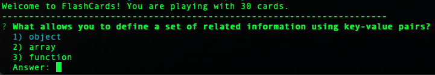

# FlashCards

## Overview

FlashCards is a multiple choice game that is run solely in your terminal/command line. This app shows one question at a time in the command line where a user uses the up, down and enter keyboard buttons to actually play the game and return to the next question. This app was developed by test driven development (TDD).

## Application in Action
Insert gif

## Technologies Used
- Javascript
- mocha test framework
- chai TDD assertion library
- github

## Installation
- 1. On the top right corner, click the **fork** button.
- 2. Once forked, click the green **code** dropdown button and copy the remote SSH key.
- 3. In your terminal, type the following:  

```bash
git clone [insert copied remote-address/SSH key]
```

- 4. Once you have cloned the repo, `cd` inside the directory and run `node index.js` to run the game.


## User Instructions
**Start the game**

- When the game starts, you will see a message in the picture above that says "Welcome to Flashcards! You are playing with 30 cards." with a question following.

**Play the game**
