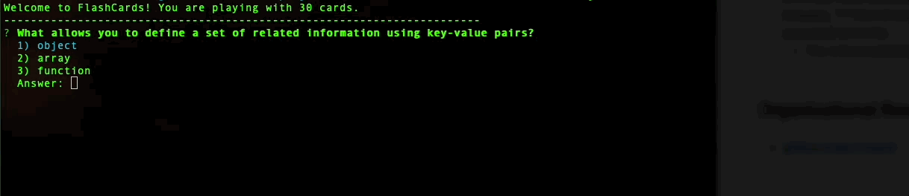
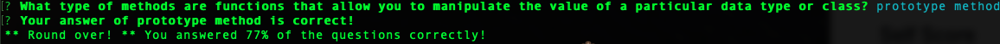

# FlashCards
[Rachel Hill](https://github.com/rachellhill)
## Abstract

FlashCards is a multiple choice game that is run solely in your terminal/command line. This app shows one question at a time in the command line where a user uses the up, down and enter keyboard buttons to actually play the game and return to the next question. This app was developed by test driven development (TDD).

## Application in Action


## Technologies Used
- Javascript
- mocha test framework
- chai TDD assertion library
- github

## Installation
- 1. On the top right corner, click the **fork** button.
- 2. Once forked, click the green **code** dropdown button and copy the remote SSH key.
- 3. In your terminal, type the following:  

```bash
git clone [insert copied remote-address/SSH key]
```

- 4. Once you have cloned the repo, `cd` inside the directory and run `node index.js` to run the game.


## User Instructions
**Start the game**

- When the game starts, you will see a message in the picture above that says "Welcome to Flashcards! You are playing with 30 cards." with a question following.

**Play the game**

- Use the up and down arrow keys to move through the given answer choices. When ready to select your answer, click enter button.
- You will receive feedback if your answer is correct or not!
- After you receive feedback, press enter again to see the next question and select your guess.
- You will go through 30 questions and at the end your score will be given to you as in the screenshot below!

- Once you see your score, the game automatically ends and you will return to the command line.

## Organizational Resources
- [github project board](https://github.com/rachellhill/flashcards-starter/projects/3)

### For Instructors
- [Project Spec](https://frontend.turing.edu/projects/flash-cards.html)
